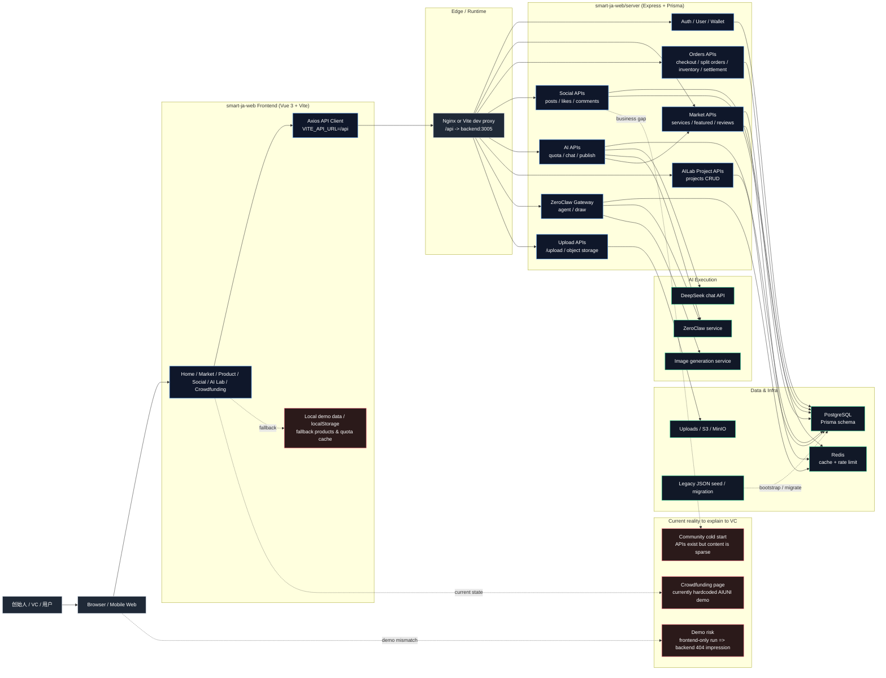

# NS Matrix Architecture Diagram

Mermaid Live:

<https://mermaid.live/edit#pako:eNqVV+9u2zYQf5UDCxQdKkdx0qytuwbwHLfzkLZe0qTDrKE4SWeZNSVqJBU7K/q9wL7u2x5ge4MBfZ51e42BpPxHclas/mLiyPvx+LvfHam3DCsjz6+LhPWMqihgOakcecp67G3EzIxyilgvYilNsRImYu9YwBKZEuuxqZCLZIbKwOlZVAAAVJrUJGIf3//28fdf/vrwAUK4HEAI//z6x9/v/4zYj35ZrOTCr/zajyCEZzLmguAVxW7ZBg86neOVx8quqzhTWM7gyXASMZ2jMp032FlQDE+ULAwVKdy5rAgO4S5cckNfrPe2vxIz0pOIfSNzslujmpOBEMZKplViR+cy4SgghP4ITjGGEAZKLtJpVaS8yBpgWPJJxPpLLjX0xyMYCE6F+SpW4fHl6OXwdX88en1xdvo4xJI3HIVMUEwidmr/IaVcQooGIfQz50YqzMgBTVGIGJM5lD5CDbfhp0oahASTGW0xtj6eo81u2TbvwRptr3Ps9/KLqEhXMDXfDsT57TA/PHlquR+mmaXwrCoMz6lxPkozmkTsecaLJUjl8gApXdlDLK/duSwnYNOLyZyKtHe4v3+0xtgKxy3rHDvInUi+bmsg1KSuSMGd4bJUpDXchbHiOsemCrAyM5u5yswghAsvw1coBJnGutzJYxKxWif98Ui76O02PCENIUwJTaUohRAUXXFa6AaEVCkpq7gXbrCBSGaUzGVlJadLwU29EkLgxRUVRqprO0XGCMqpaAamnUgnEavVukYtpTYWQ/C5iy6RuXVuxoROtqONlxdUCMkMbTxlFQuuZy0fgbFzs0UxVvINJVuElN6gYXB2cdJw/JmUTAQuJhH7gZQcCFzAUzS0QC8EzKiwm6YKFw3HqhQS00nELtxgs1foZyAEGbsotK+Xm+RjZeProTKzlslnt2X0WWgZPd1tRL5jEBi3bKvTt8z+BDt6Pum/7E8idmJ7wW0YFVOFze4ltcmUa2BjPzz/7tRx4lUOOplR3vRRlHLrcGb/vfJs44C7oNAQCJ7zprY8qWverYrOD22v5MXoRbONUYbJte1jbgDfnr94DppcLeQ8U2i4LG4salt4rsHUB/Jmn5AbJurS2J3wiblhAvmNRoHxp/d1bO1gb1lXCW3ba006CTkCvdlTZFtvLKXRRmG5JodcF96E0hJDfzT8fjjwlTpcUlI12LS/lKjURHMrGaLynGjuS7g/Hu3UIBUZL2i7Cusm1ljJc8woo2ISsZEdQkYF+UTurN9OqKd7FVDDuNn8BgY/ObkKpgG3qtoWW0/740nEBpVStp0oQsHNNRgJtCwF8sIOLweNsyb2XrdOW/e7u/J8lXgocQ0zVKl996TQH108H7n7utmpssTCyDyvCrtrIkUK2qDybwHbuICWXBuIKwOJe6UY4Bp0iUpTK6e5pOLKpTSXoLie+3dA/bjpyEJcg6oKeLy+POHe/j3gubvx/qPi1i+A+lg2vFqAjoam5PcgrjQv7AWaYelWVVnSeh/s+YdLbhuPSWZuVR39atdEoNYnNIVEKoIpF6J3a3/avX+AgTZKzql368t9PJpikEghVe/W1P3qyc6Cp2bW6+4dlMtHLUBue2ON2O12HxzcXyMe3ksPHz78bETLdA14EHexuwlxGt/vPjj6bEDb7AdCr4KcHjw83ASZxOkRdf8P5haqz2KAJQ9sBw18KQS+OwY+eQHywPW5YFVKQd2abA4eNdDqzhO4Nhb4thX4jhWsSjnYVGiwqkfPfgPLiSiosiSoJRC416VjtbHQvuuDWkOBuw9rnh5FBQtYiQWtvkco5UaqZ/6Lw314BEzJKpux3hSFpoBVZYqGTjhmCnPv9u5f1rYqbw==>

