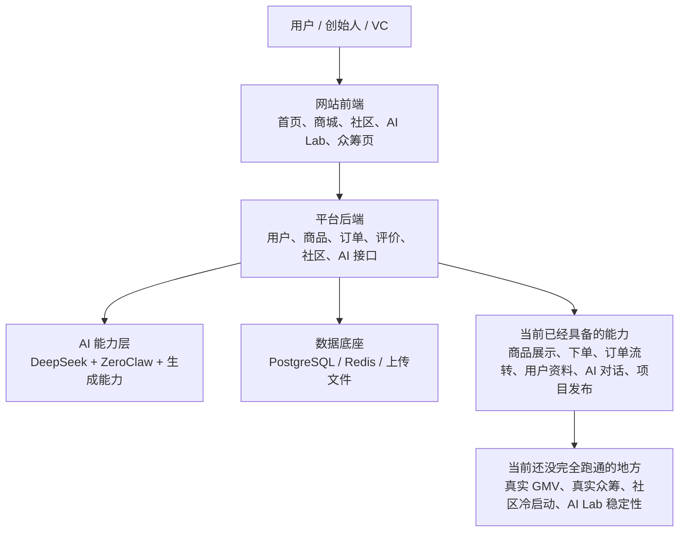

# NS Matrix 架构图（人话版）

这不是给工程师排查问题用的图，而是给创始人、VC、合作方快速理解系统用的版本。

一句话解释：

> NS Matrix 现在已经不是单纯的前端原型，而是一个“前端展示 + 后端交易与用户系统 + AI 孵化能力 + 数据底座”都已搭起雏形的平台；只是目前真正跑通的商业证据还不够强。

---

## 1. 人话架构图

---

## 2. 每一层到底是干什么的

### 用户层

- 创始人、投资人、普通用户，最终看到的都是网站页面
- 他们不会区分前端、后端、数据库，只会判断“这个系统到底能不能用、能不能成交、能不能证明商业成立”

### 前端层

前端是用户看到的部分，主要包括：

- 首页
- 商城
- 商品详情
- 社区
- AI Lab
- 众筹页

它的作用是：

- 把平台能力展示给用户
- 收集用户操作
- 调后端接口

问题在于：

- 如果只开前端、不带后端一起演示，外部会误以为系统很多能力根本不存在

### 后端层

后端是平台真正的业务中枢。

它现在已经承担了这些事情：

- 用户登录与资料
- 钱包和订单
- 商品、评价与市场数据
- 社区内容接口
- AI 配额与 AI 对话
- AI 生成项目后发布到市场

所以更准确地说：

- 当前系统不是“只有漂亮页面”
- 而是“已经有了业务后端，只是还没完全把业务结果跑出来”

### AI 能力层

AI 部分不是一个简单聊天框，而是平台最有潜力的部分之一。

它承担的是：

- 和用户对话
- 帮用户梳理产品想法
- 协调不同 AI 角色
- 生成内容与方案
- 把产出的项目进一步发布到市场

这也是为什么 VC 会认为：

- AI Lab 可能是整个项目最有价值的核心

### 数据底座

系统底层还依赖一套数据和基础设施：

- PostgreSQL：存用户、商品、订单、项目
- Redis：做缓存和限流
- 文件存储：存上传图片等资源

这部分决定的是：

- 平台不是纯演示，而是有真实数据承载能力

---

## 3. 对外可以怎么讲这套系统

可以把它讲成下面这句话：

> NS Matrix 已经具备了一个创业协作平台的基础架构：前端负责展示与交互，后端负责用户、订单、市场和社区，AI 层负责创意孵化与协作生成，数据层负责沉淀业务数据。当前最关键的任务不是继续加页面，而是尽快跑出真实成交和真实案例。

---

## 4. 这张图最想说明的重点

### 重点 1：我们不是只有前端

这次外部反馈里最大的误解之一，是把“前端单独运行时的体验”当成了“系统整体完成度”。

真实情况是：

- 后端已经存在
- 交易链路已经存在
- AI 配额和 AI 路由已经存在
- 数据模型已经存在

### 重点 2：我们真正缺的不是代码，而是证据

当前最欠缺的不是再写几个模块，而是以下三类商业验证：

- 第一笔真实 GMV
- AI Lab 跑通一个真实创客案例
- 众筹板块出现一个真实项目和真实资金流

### 重点 3：平台已经有“系统雏形”，但还没形成“商业说服力”

也就是说：

- 技术底座已经足够让人认真对待
- 但还没有足够多真实结果，证明这个底座正在转化成业务

---

## 5. 当前最适合给创始人的一句总结

> NS Matrix 现在已经有平台架构，不是单纯原型；但对外最需要补的不是“功能列表”，而是“真实成交、真实用户、真实案例”。

---

## 6. 如果要配合 VC 汇报，这张图应该怎么用

建议搭配三句话一起讲：

1. 我们不是只有前端页面，后端交易、用户、AI 和数据底座都已经搭起来了。
2. 现在的核心问题不是能不能继续做功能，而是要尽快跑出真实 GMV 和真实项目闭环。
3. 所以下一阶段的目标不是扩模块，而是验证成交、验证 AI Lab、验证众筹。
